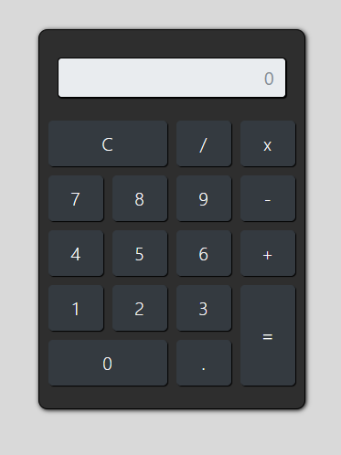

 <h1 align="center">Calculadora</h1>

## Sobre o projeto

### Screenshot

<p align="center">
    
</p>

App para calcular números, utilizando js e bootstrap 4. Criado totalmente para fins acadêmicos

### Recursos usados

* [Javascript](https://www.javascript.com/)
* [Bootstrap 4](https://getbootstrap.com/)

## Iniciando o Projeto

1. Execute o arquivo ``` index.html ``` em seu navegador.
